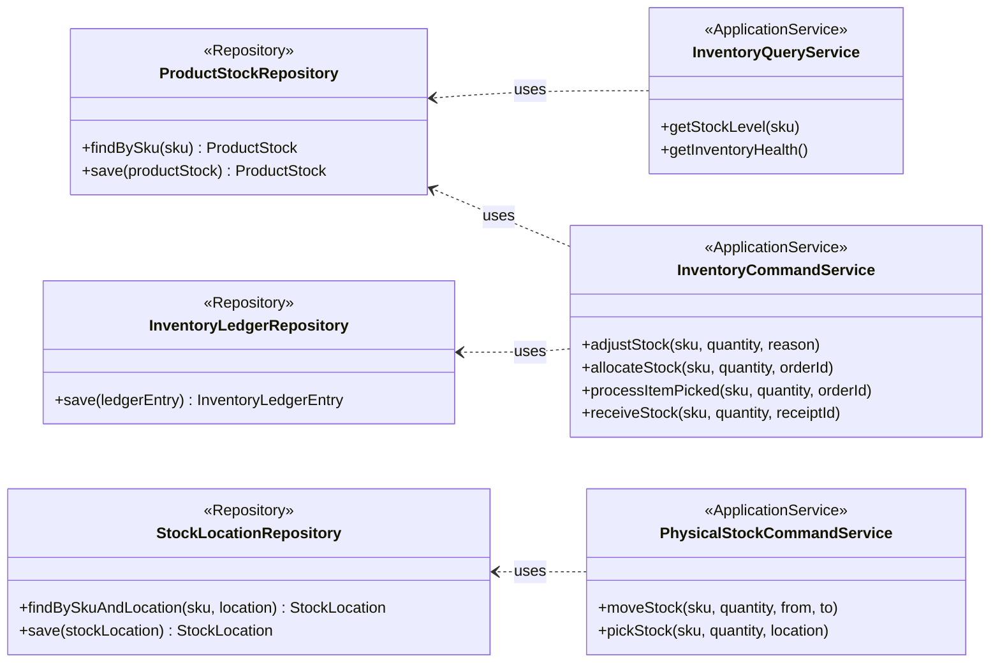

# Application Services & Infrastructure

This diagram shows the application services and their relationship with the domain layer (repositories).

- **Application Services (`<<ApplicationService>>`)**: These services orchestrate the business logic. They use repositories to retrieve and store aggregates and call the domain objects to perform operations. `InventoryCommandService` and `InventoryQueryService` are examples.
- **Repositories (`<<Repository>>`)**: These are interfaces defined in the domain layer but implemented in the infrastructure layer. They provide an abstraction for persisting and retrieving aggregates.

