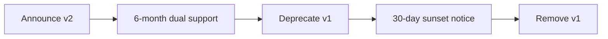

# API Versioning Strategy

## Overview

The Inventory Management API uses **URL-based versioning** to ensure backward compatibility while enabling continuous evolution of the API.

## Versioning Approach

### URL-Based Versioning

Version is specified in the URL path:
```
https://api.paklog.com/fulfillment/inventory/v1/stock_levels/{sku}
https://api.paklog.com/fulfillment/inventory/v2/stock_levels/{sku}
```

**Benefits**:
- ✅ Clear and explicit version indication
- ✅ Easy to route and cache
- ✅ Simple client implementation
- ✅ No header parsing required
- ✅ Works with all HTTP clients

## Version Lifecycle

### 1. Active Versions

| Version | Status | Supported Until | Notes |
|---------|--------|----------------|-------|
| v1 | **Stable** | Indefinite | Current production version |
| v2-beta | **Preview** | N/A | Beta features for testing |

### 2. Version States

```
Preview (v2-beta)
    ↓
Stable (v2)
    ↓
Deprecated (v1 after v2 stable)
    ↓
Sunset (6 months after deprecation)
```

## Versioning Rules

### When to Introduce a New Version

Introduce a **major version** (v2, v3, etc.) when making **breaking changes**:

#### Breaking Changes
- Removing endpoints
- Removing request/response fields
- Changing field types (e.g., string → integer)
- Changing field semantics
- Changing authentication mechanism
- Changing error response format

#### Non-Breaking Changes (Same Version)
- Adding new endpoints
- Adding optional request fields
- Adding response fields
- Adding new error codes
- Performance improvements
- Bug fixes

### Semantic Versioning Alignment

API versions align with semantic versioning:
- **v1** = Major version 1.x.x
- **v2** = Major version 2.x.x

Minor and patch versions are internal and don't appear in URL.

## Version Support Policy

### Support Timeline

1. **Stable**: Fully supported, recommended for production
2. **Deprecated** (6 months): Supported but not recommended
3. **Sunset** (30 days notice): Will be removed soon
4. **Removed**: No longer available

### Deprecation Process



#### Timeline Example
- **Day 0**: v2 released as stable, v1 marked deprecated
- **Day 180**: 30-day sunset notice for v1
- **Day 210**: v1 removed

### Deprecation Headers

Deprecated endpoints return warning headers:
```http
Deprecation: Sat, 1 Apr 2026 00:00:00 GMT
Sunset: Wed, 1 Oct 2026 00:00:00 GMT
Link: <https://docs.paklog.com/api/migration/v1-to-v2>; rel="deprecation"
```

## Migration Guidelines

### Client Migration Checklist

1. **Review Migration Guide**: Read version-specific migration docs
2. **Test in Staging**: Use preview/beta version in staging environment
3. **Update Code**: Modify client code for breaking changes
4. **Run Tests**: Validate all integration tests
5. **Monitor Metrics**: Check error rates and performance
6. **Switch Traffic**: Gradually migrate production traffic
7. **Remove Old Code**: Clean up v1-specific code after full migration

### Example Migration: v1 → v2

#### v1 Response (Deprecated)
```json
{
  "sku": "SKU-12345",
  "qty_on_hand": 500,
  "qty_allocated": 150
}
```

#### v2 Response (Current)
```json
{
  "sku": "SKU-12345",
  "quantity": {
    "on_hand": 500,
    "allocated": 150,
    "available": 350
  },
  "metadata": {
    "last_updated": "2025-10-05T20:00:00Z",
    "version": "v2"
  }
}
```

**Changes**:
- Nested quantity object for better organization
- Snake_case → camelCase for field names
- Added metadata section
- Calculated `available` field

## Version Detection

### Request Headers

Clients can specify preferred version via header:
```http
Accept: application/vnd.paklog.inventory.v2+json
```

**Priority**:
1. URL version (`/v1/...` or `/v2/...`)
2. Accept header version
3. Default to latest stable

### Response Headers

Responses include version information:
```http
API-Version: v1
Content-Type: application/json
```

## Backward Compatibility

### Additive Changes (Safe)

✅ **Safe to add without version bump**:
- New endpoints
- New optional query parameters
- New optional request fields
- New response fields
- New HTTP methods on existing endpoints

### Breaking Changes (Require New Version)

❌ **Require major version bump**:
- Removing endpoints
- Removing fields
- Changing field types
- Renaming fields
- Changing required/optional status
- Changing validation rules (stricter)

## Preview/Beta Versions

### Purpose
- Test new features with early adopters
- Gather feedback before stable release
- Allow breaking changes during beta period

### Beta Version URLs
```
https://api.paklog.com/fulfillment/inventory/v2-beta/...
```

### Beta Stability
- ⚠️ No backward compatibility guarantees
- ⚠️ May have breaking changes between beta releases
- ⚠️ Not recommended for production use
- ✅ Perfect for testing and feedback

### Beta → Stable Transition
When beta becomes stable:
1. Create stable `/v2/` endpoints
2. Keep `/v2-beta/` for 30 days
3. Redirect `/v2-beta/` to `/v2/`
4. Remove `/v2-beta/` after 30 days

## Version-Specific Documentation

### Documentation Structure
```
docs/
├── api/
│   ├── v1/
│   │   ├── openapi.yaml
│   │   ├── getting-started.md
│   │   └── migration-from-v0.md
│   ├── v2-beta/
│   │   ├── openapi.yaml
│   │   ├── getting-started.md
│   │   └── whats-new.md
│   └── current → v1  # Symlink to current stable
```

### OpenAPI Specifications
Each version has its own OpenAPI spec:
- `openapi-v1.yaml`
- `openapi-v2.yaml`

## Testing Strategy

### Version Testing Matrix

| Test Type | v1 | v2-beta | v2 (future) |
|-----------|----|---------|----- |
| Unit Tests | ✅ | ✅ | ✅ |
| Integration Tests | ✅ | ✅ | ✅ |
| Contract Tests | ✅ | ⚠️ | ✅ |
| E2E Tests | ✅ | ⚠️ | ✅ |
| Performance Tests | ✅ | ❌ | ✅ |

### Test Isolation
- Separate test suites per version
- Shared test utilities
- Version-specific fixtures

## Monitoring & Observability

### Metrics by Version

Track metrics per API version:
```
inventory_api_requests_total{version="v1", endpoint="/stock_levels", method="GET"}
inventory_api_requests_total{version="v2-beta", endpoint="/stock_levels", method="GET"}
```

### Version Adoption Tracking

Monitor version usage:
```
inventory_api_version_usage{version="v1"} 85%
inventory_api_version_usage{version="v2-beta"} 15%
```

### Alerts

Set up alerts for:
- High error rate on specific version
- Deprecated version usage > 10% after sunset notice
- Beta version usage in production (optional warning)

## API Gateway Configuration

### Routing Rules

API Gateway routes by version prefix:
```yaml
routes:
  - path: /fulfillment/inventory/v1/*
    backend: inventory-service-v1
  - path: /fulfillment/inventory/v2/*
    backend: inventory-service-v2
  - path: /fulfillment/inventory/v2-beta/*
    backend: inventory-service-v2-beta
```

### Default Version

Requests without version default to latest stable:
```
/fulfillment/inventory/stock_levels/SKU-12345
→ /fulfillment/inventory/v1/stock_levels/SKU-12345
```

## Client Libraries

### Version Support in SDKs

Official client libraries support multiple versions:

```java
// Java SDK
InventoryClient client = InventoryClient.builder()
    .apiVersion(ApiVersion.V1)
    .build();

// Or for beta testing
InventoryClient betaClient = InventoryClient.builder()
    .apiVersion(ApiVersion.V2_BETA)
    .build();
```

```python
# Python SDK
client = InventoryClient(api_version='v1')
beta_client = InventoryClient(api_version='v2-beta')
```

### SDK Versioning

SDK versions follow API versions:
- `inventory-sdk-java:1.x.x` → API v1
- `inventory-sdk-java:2.x.x` → API v2

## Best Practices

### For API Developers

1. **Plan Ahead**: Design v1 with future extensibility in mind
2. **Document Changes**: Maintain detailed changelog
3. **Test Thoroughly**: Ensure backward compatibility in same version
4. **Communicate Early**: Announce breaking changes 6+ months in advance
5. **Support Overlap**: Maintain 2 major versions during transition

### For API Consumers

1. **Pin Version**: Always specify version in URL
2. **Monitor Deprecations**: Watch for deprecation headers
3. **Test Early**: Try beta versions in staging
4. **Plan Migration**: Don't wait until last minute
5. **Use Latest**: Migrate to latest stable when ready

## Change Log Format

### Version Change Log Template

```markdown
## v2.0.0 (2026-01-15)

### Breaking Changes
- Changed field name `qty_on_hand` → `quantity.on_hand`
- Removed deprecated `/adjustments` endpoint
- Changed error response format

### New Features
- Added `/allocations/bulk` endpoint for batch processing
- Added metadata to all responses
- Added support for partial updates

### Improvements
- 50% faster stock level queries with caching
- Better error messages with trace IDs

### Deprecations
- `/stock_levels/{sku}/allocate` deprecated, use `/allocations` instead

### Migration Guide
See [v1-to-v2-migration.md](./migrations/v1-to-v2.md)
```

## Resources

- **Current API Docs**: https://docs.paklog.com/api/current
- **Version Migration Guides**: https://docs.paklog.com/api/migrations
- **API Change Log**: https://github.com/paklog/inventory/CHANGELOG.md
- **Support**: platform@paklog.com
