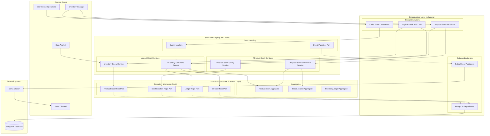

# Inventory Management Service - Architecture Diagrams

## 1. Domain Model - Detailed Class Diagram (Updated)

```mermaid
classDiagram
    direction LR

    subgraph "Logical Stock"
        ProductStock {
            <<Aggregate Root>>
            -String sku
            -StockLevel stockLevel
            -LocalDateTime lastUpdated
            +allocate(int quantity)
            +deallocate(int quantity)
            +adjustQuantityOnHand(int change, String reason)
        }
        StockLevel {
            <<Value Object>>
            -int quantityOnHand
            -int quantityAllocated
            +int getAvailableToPromise()
        }
        ProductStock "1" *-- "1" StockLevel : contains
    end

    subgraph "Physical Stock"
        StockLocation {
            <<Aggregate Root>>
            -String sku
            -Location location
            -int quantity
            +addStock(int quantity)
            +removeStock(int quantity)
            +addPhysicalReservation(String reservationId, int quantity)
        }
        Location {
            <<Value Object>>
            -String aisle
            -String shelf
            -String bin
        }
        PhysicalReservation {
            <<Entity>>
            -String reservationId
            -int quantity
        }
        StockLocation "1" *-- "1" Location : located at
        StockLocation "1" *-- "0..*" PhysicalReservation : has
    end

    subgraph "Auditing & Events"
        InventoryLedgerEntry {
            <<Aggregate Root>>
            -String id
            -String sku
            -int quantityChange
            -ChangeType changeType
            +forAllocation(sku, quantity, orderId)
            +forPick(sku, quantity, orderId)
        }
        OutboxEvent {
            <<Entity>>
            -String id
            -String aggregateId
            -String eventData
            -boolean processed
        }
        DomainEvent {
            <<Abstract>>
            -String eventId
            -LocalDateTime occurredOn
        }
        StockLevelChangedEvent {
             -String sku
             -StockLevel newLevel
        }
    end
    
    ProductStock --> DomainEvent : publishes
    StockLocation --> DomainEvent : publishes
    DomainEvent <|-- StockLevelChangedEvent
    InventoryLedgerEntry --> ChangeType
    
    class ChangeType {
        <<Enumeration>>
        ALLOCATION
        DEALLOCATION
        PICK
        RECEIPT
        ADJUSTMENT_POSITIVE
        ADJUSTMENT_NEGATIVE
    }
```

## 2. Hexagonal Architecture - Detailed Layer Diagram (Updated)



## 3. Event Choreography Flow


## 4. Item Picking Event Flow

```mermaid
sequenceDiagram
    participant WMS as Warehouse Management
    participant KIN as Kafka (Inbound)
    participant EVT as Event Handler
    participant CMD as Command Service
    participant AGG as ProductStock Aggregate
    participant AUDIT as Audit Service
    participant REPO as Repository
    participant OUTBOX as Outbox Repository
    participant KOUT as Kafka (Outbound)
    
    Note over WMS, KOUT: Item Picked Scenario
    
    WMS->>+KIN: ItemPicked Event (sku, quantity, orderId)
    KIN->>+EVT: Consume Event
    EVT->>+CMD: ProcessItemPickedCommand(sku, quantity, orderId)
    
    CMD->>+REPO: findBySku(sku)
    REPO-->>-CMD: ProductStock
    
    par Update Stock Levels
        CMD->>+AGG: deallocate(quantity)
        AGG->>AGG: quantityAllocated -= quantity
        AGG-->>-CMD: success
    and
        CMD->>+AGG: adjustQuantityOnHand(-quantity, "PICKED")
        AGG->>AGG: quantityOnHand -= quantity
        AGG->>AGG: addEvent(StockLevelChangedEvent)
        AGG-->>-CMD: success
    end
    
    CMD->>+AUDIT: createLedgerEntry(PICK, sku, -quantity, orderId)
    AUDIT-->>-CMD: InventoryLedgerEntry
    
    par Transaction - Save All Changes
        CMD->>+REPO: save(productStock)
        REPO-->>-CMD: saved
    and
        CMD->>+REPO: save(ledgerEntry)
        REPO-->>-CMD: saved
    and
        CMD->>+OUTBOX: save(OutboxEvent.from(domainEvent))
        OUTBOX-->>-CMD: saved
    end
    
    CMD-->>-EVT: success
    EVT-->>-KIN: ack
    
    Note over OUTBOX, KOUT: Async Event Publishing
    KOUT->>OUTBOX: Poll for events
    KOUT->>KOUT: Publish StockLevelChanged
```



## 5. ProductStock Aggregate State Transitions


## 6. Data Access Pattern - Repository Layer

```mermaid
graph TB
    subgraph "Application Layer"
        CS[Command Service]
        QS[Query Service]
    end
    
    subgraph "Domain Layer (Ports)"
        PSR_PORT[ProductStockRepository Interface]
        LR_PORT[LedgerRepository Interface] 
        OR_PORT[OutboxRepository Interface]
    end
    
    subgraph "Infrastructure Layer (Adapters)"
        subgraph "MongoDB Adapters"
            PSR_IMPL[ProductStockRepositoryImpl]
            LR_IMPL[LedgerRepositoryImpl]
            OR_IMPL[OutboxRepositoryImpl]
        end
        
        subgraph "MongoDB Documents"
            PS_DOC[ProductStockDocument]
            L_DOC[LedgerEntryDocument]
            O_DOC[OutboxEventDocument]
        end
        
        subgraph "Spring Data"
            PS_SPRING[ProductStockSpringRepository]
            L_SPRING[LedgerSpringRepository]
            O_SPRING[OutboxSpringRepository]
        end
    end
    
    subgraph "Database"
        MONGO[(MongoDB)]
    end
    
    %% Application to Domain
    CS --> PSR_PORT
    CS --> LR_PORT
    CS --> OR_PORT
    QS --> PSR_PORT
    QS --> LR_PORT
    
    %% Port Implementations
    PSR_PORT -.-> PSR_IMPL
    LR_PORT -.-> LR_IMPL
    OR_PORT -.-> OR_IMPL
    
    %% Repository Implementations
    PSR_IMPL --> PS_DOC
    PSR_IMPL --> PS_SPRING
    LR_IMPL --> L_DOC
    LR_IMPL --> L_SPRING
    OR_IMPL --> O_DOC
    OR_IMPL --> O_SPRING
    
    %% Spring Data to MongoDB
    PS_SPRING --> MONGO
    L_SPRING --> MONGO
    O_SPRING --> MONGO
    
    note right of PSR_IMPL
        Repository Implementation:
        - Domain model ↔ Document mapping
        - Exception translation
        - Transaction management
    end note
```

## 7. Event Publishing Architecture - Transactional Outbox

```mermaid
graph TB
    subgraph "Transaction Boundary"
        subgraph "Business Operation"
            AGG[ProductStock Aggregate]
            DOMAIN_EVENT[Domain Event Creation]
        end
        
        subgraph "Persistence Layer"
            AGG_SAVE[Save Aggregate]
            OUTBOX_SAVE[Save Outbox Event]
        end
    end
    
    subgraph "Event Publishing (Separate Process)"
        SCHEDULER[Scheduled Task @5s intervals]
        OUTBOX_READER[Outbox Event Reader]
        EVENT_PUBLISHER[CloudEvent Publisher]
        KAFKA_PRODUCER[Kafka Producer]
        OUTBOX_UPDATER[Mark Events as Processed]
    end
    
    subgraph "External Systems"
        KAFKA_TOPIC[fulfillment.inventory.v1.events]
        CONSUMERS[Downstream Consumers]
    end
    
    subgraph "Database"
        MONGO[(MongoDB)]
        subgraph "Collections"
            PS_COLL[product_stocks]
            OUTBOX_COLL[outbox_events]
            LEDGER_COLL[inventory_ledger]
        end
    end
    
    %% Business flow
    AGG --> DOMAIN_EVENT
    DOMAIN_EVENT --> AGG_SAVE
    DOMAIN_EVENT --> OUTBOX_SAVE
    
    %% Persistence
    AGG_SAVE --> PS_COLL
    OUTBOX_SAVE --> OUTBOX_COLL
    
    %% Event publishing flow
    SCHEDULER --> OUTBOX_READER
    OUTBOX_READER --> OUTBOX_COLL
    OUTBOX_READER --> EVENT_PUBLISHER
    EVENT_PUBLISHER --> KAFKA_PRODUCER
    KAFKA_PRODUCER --> KAFKA_TOPIC
    KAFKA_TOPIC --> CONSUMERS
    EVENT_PUBLISHER --> OUTBOX_UPDATER
    OUTBOX_UPDATER --> OUTBOX_COLL
    
    note right of SCHEDULER
        Guarantees:
        - At-least-once delivery
        - Event ordering per aggregate
        - No event loss on system failure
    end note
```

## 8. API Contract Flow - REST Endpoints


## 9. Error Handling and Resilience Patterns


## 10. Deployment Architecture


These detailed diagrams provide comprehensive visual documentation for developers to understand:

1. **Domain Model Structure** - DDD aggregates, entities, and value objects
2. **Hexagonal Architecture** - Clear separation of concerns and dependency directions
3. **Event Choreography** - How events flow through the system
4. **State Management** - ProductStock aggregate lifecycle
5. **Data Access Patterns** - Repository implementation strategy
6. **Event Publishing** - Transactional outbox pattern implementation
7. **API Contracts** - REST endpoint interaction flows
8. **Error Handling** - Resilience and error management strategies
9. **Deployment Architecture** - Production infrastructure layout

Each diagram focuses on specific architectural concerns while maintaining consistency with the overall system design principles.