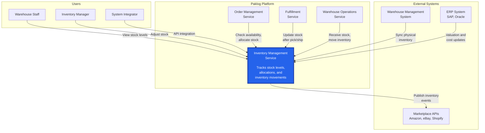
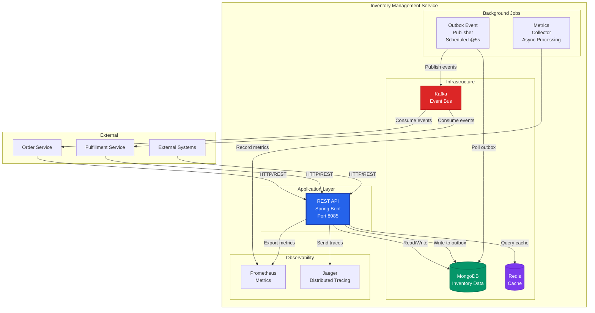
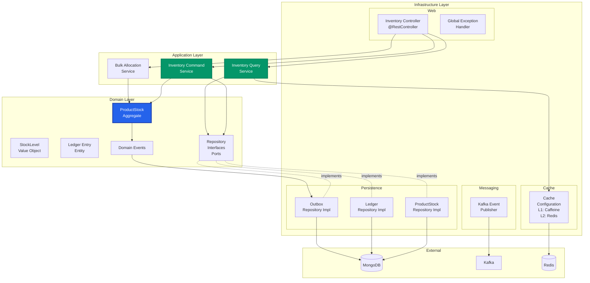
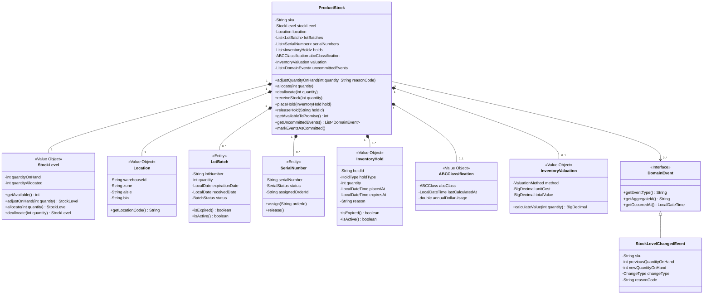
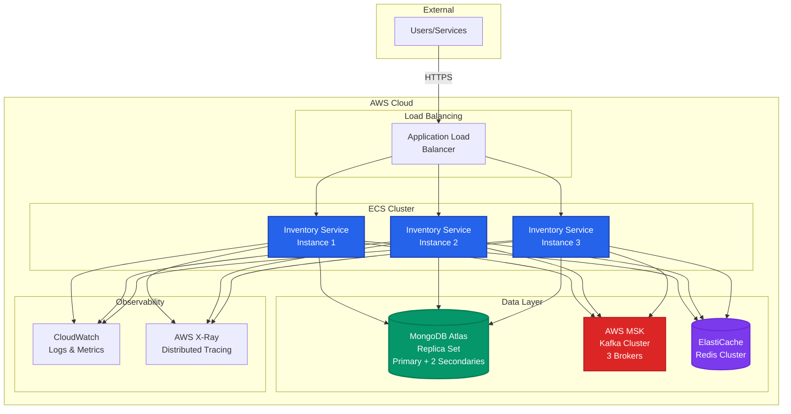
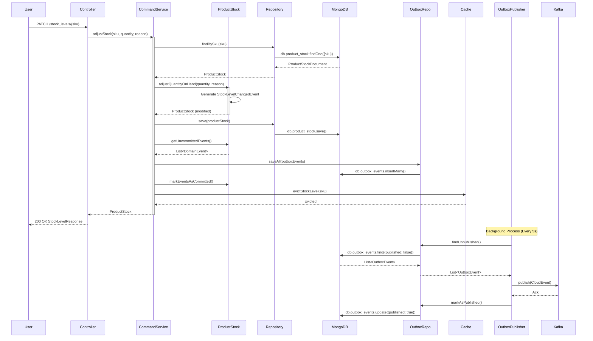

# C4 Model Diagrams - Inventory Management Service

## Overview

The C4 model provides a way to describe and communicate software architecture at different levels of abstraction.

**Levels**:
1. **System Context**: How the system fits into the world
2. **Container**: High-level technology choices and responsibilities
3. **Component**: Components within a container
4. **Code**: How components are implemented (UML class diagrams)

---

## Level 1: System Context Diagram

Shows how the Inventory Service fits into the Paklog ecosystem.

**Key Relationships**:
- **Users**: Warehouse staff view stock, inventory managers adjust stock
- **Internal Services**: Order service allocates stock, fulfillment updates stock
- **External Systems**: WMS syncs physical inventory, ERP provides cost data

---

## Level 2: Container Diagram

Shows the containers (applications/services) within the Inventory Service.

**Key Containers**:
- **REST API**: Spring Boot application handling HTTP requests
- **MongoDB**: Primary data store for inventory data
- **Kafka**: Event streaming platform for pub/sub
- **Redis**: Distributed cache for performance
- **Background Jobs**: Outbox publisher, metrics collection
- **Observability**: Prometheus metrics, Jaeger tracing

---

## Level 3: Component Diagram

Shows the components within the REST API container.

**Key Components**:

**Infrastructure Layer**:
- **Controllers**: HTTP endpoint handling
- **Repository Implementations**: MongoDB adapters
- **Event Publisher**: Kafka producer
- **Cache Configuration**: Multi-tier caching

**Application Layer**:
- **Command Service**: Write operations (adjustments, allocations)
- **Query Service**: Read operations (stock levels, health metrics)
- **Bulk Service**: High-performance bulk operations

**Domain Layer**:
- **Product Stock**: Core aggregate
- **Stock Level**: Value object
- **Repository Interfaces**: Ports for persistence
- **Domain Events**: Business events

---

## Level 4: Code Diagram - ProductStock Aggregate

UML class diagram showing the ProductStock aggregate structure.

**Key Design Patterns**:
- **Aggregate Pattern**: ProductStock is the aggregate root
- **Value Objects**: Immutable objects like StockLevel, Location
- **Entity Pattern**: LotBatch and SerialNumber have identity
- **Domain Events**: ProductStock generates events on state changes

---

## Deployment Diagram

Shows how the system is deployed in production.

**Deployment Characteristics**:
- **High Availability**: 3 service instances across availability zones
- **Managed Services**: MongoDB Atlas, AWS MSK, ElastiCache
- **Auto-scaling**: ECS service scales based on CPU/memory
- **Load Distribution**: ALB distributes traffic across instances

---

## Data Flow Diagram

Shows how data flows through the system for a stock adjustment.

---

## References

- [C4 Model](https://c4model.com/)
- [Structurizr](https://structurizr.com/)
- [Mermaid Diagrams](https://mermaid.js.org/)

---

**Last Updated**: 2025-10-05
