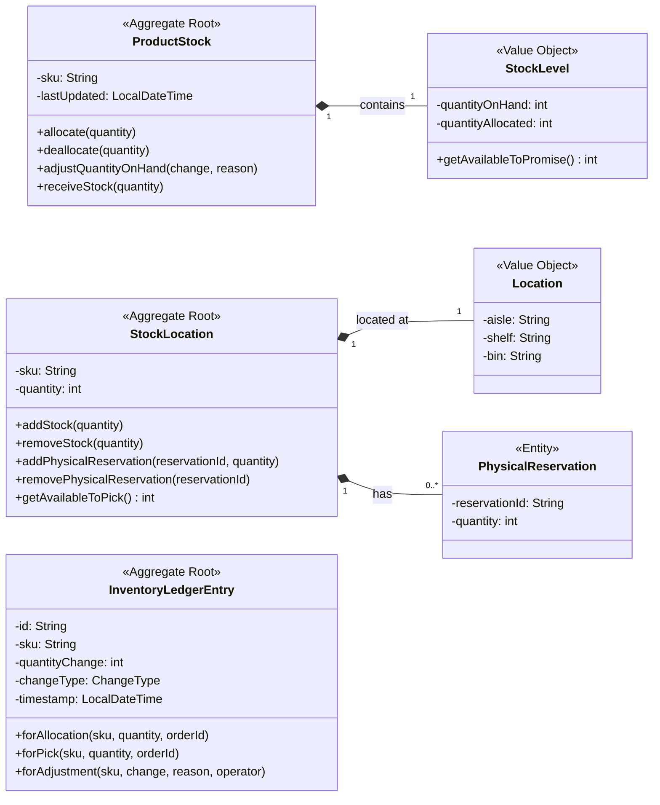

# Domain-Driven Design Documentation

This document provides a definitive guide to the domain model of the Inventory Service, based directly on the source code. It outlines the aggregates, entities, and value objects that form the core of the service's business logic.

## 1. Domain Model Overview

The domain model is separated into two primary bounded contexts, plus a supporting audit context:

1.  **Logical Stock (`ProductStock` Aggregate)**: Manages the overall inventory levels for a product (SKU). It is concerned with the "financial" or "sellable" view of stock, including what is on hand versus what is allocated to sales orders.
2.  **Physical Stock (`StockLocation` Aggregate)**: Manages the physical placement and quantity of a product in a specific warehouse location (e.g., aisle, shelf, bin). It is concerned with the "warehouse" view of stock, including what is available to be picked.
3.  **Audit Trail (`InventoryLedgerEntry` Aggregate)**: Provides an immutable log of all stock movements and changes for auditing and traceability.

## 2. Core Concepts

### Aggregates

Aggregates are consistency boundaries that group together related objects into a single unit. They are the primary objects managed by repositories.

*   **`ProductStock` (Aggregate Root)**
    *   **Purpose**: Represents the definitive record of sellable inventory for a single SKU. It tracks the total quantity on hand and how much of that is allocated (reserved for orders).
    *   **Identity**: `sku` (String)
    *   **Invariants**:
        *   `quantityOnHand` cannot be negative.
        *   `quantityAllocated` cannot be negative.
        *   `quantityAllocated` must not exceed `quantityOnHand`.
    *   **Core Operations**: `allocate()`, `deallocate()`, `adjustQuantityOnHand()`, `receiveStock()`.

*   **`StockLocation` (Aggregate Root)**
    *   **Purpose**: Represents the physical amount of stock for a single SKU at a specific, named location in the warehouse.
    *   **Identity**: Composite of `sku` (String) and `location` (Location VO).
    *   **Invariants**:
        *   `quantity` (physical count) cannot be negative.
        *   The total quantity of all `PhysicalReservation`s cannot exceed the physical `quantity`.
    *   **Core Operations**: `addStock()`, `removeStock()`, `addPhysicalReservation()`, `removePhysicalReservation()`.

*   **`InventoryLedgerEntry` (Aggregate Root)**
    *   **Purpose**: An immutable record of a single stock-changing event (e.g., allocation, pick, adjustment). It serves as the system's audit trail.
    *   **Identity**: `id` (UUID String)
    *   **Nature**: Immutable. It is created via factory methods (`forAllocation`, `forPick`, etc.) and cannot be modified after creation.

### Entities

Entities are objects with a distinct identity that are not aggregate roots. Their lifecycle is managed by an aggregate.

*   **`PhysicalReservation` (Entity)**
    *   **Purpose**: Represents a "soft" reservation of a specific quantity of stock at a `StockLocation`, typically for a warehouse picklist.
    *   **Identity**: `reservationId` (String)
    *   **Parent Aggregate**: `StockLocation`. It cannot exist independently.

### Value Objects

Value Objects are immutable objects without a distinct identity, defined only by their attributes.

*   **`StockLevel` (Value Object)**
    *   **Purpose**: Encapsulates the `quantityOnHand` and `quantityAllocated` as a single, immutable concept.
    *   **Attributes**: `quantityOnHand` (int), `quantityAllocated` (int).
    *   **Parent Aggregate**: `ProductStock`.

*   **`Location` (Value Object)**
    *   **Purpose**: Represents a physical location in the warehouse.
    *   **Attributes**: `aisle` (String), `shelf` (String), `bin` (String).
    *   **Parent Aggregate**: `StockLocation`.

## 3. Domain Model Class Diagram

This diagram illustrates the relationships between all the aggregates, entities, and value objects in the system.

