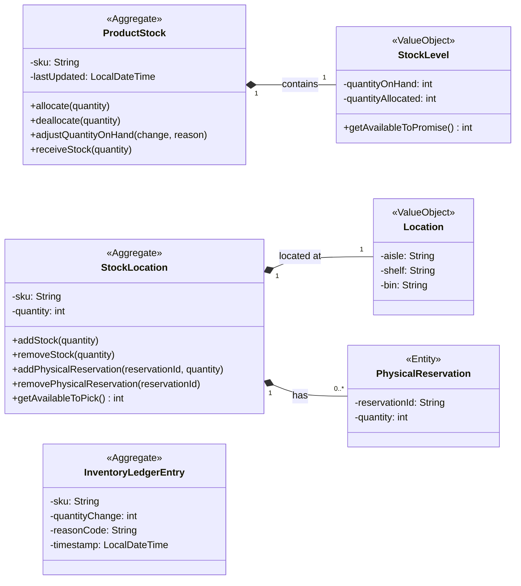

# Domain Model: Aggregates, Entities, and Value Objects

This diagram illustrates the core domain model of the inventory system, identifying the aggregates, entities, and value objects according to Domain-Driven Design principles.

- **Aggregates (`<<Aggregate>>`)**: `ProductStock` and `StockLocation` are the two main aggregates. They encapsulate business logic and ensure the consistency of the objects within their boundaries.
- **Entities (`<<Entity>>`)**: `PhysicalReservation` is an entity within the `StockLocation` aggregate. It has its own identity but its lifecycle is managed by `StockLocation`.
- **Value Objects (`<<ValueObject>>`)**: `StockLevel` and `Location` are value objects. They are immutable and their equality is based on their attributes, not an ID.

